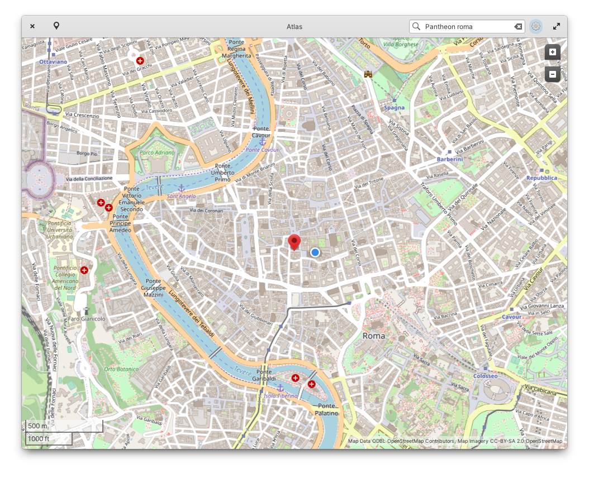

# Atlas
Atlas is a map viewer designed for elementary OS.



This is a fork of [Atlas Maps](https://launchpad.net/atlas-maps) and wouldn't exist without work of [Steffen Schuhmann](https://launchpad.net/~sschuhmann).

## Installation
### For Users
On elementary OS? Click the button to get Atlas on AppCenter:

[](https://appcenter.elementary.io/com.github.ryonakano.atlas)

### For Developers
You'll need the following dependencies:

* libgeoclue-2-dev
* libgeocode-glib-dev (>= 3.26.3)
* libshumate-dev
* libgranite-7-dev (>= 7.1.0)
* libgtk-4-dev
* meson (>= 0.57.0)
* valac

Run `meson setup` to configure the build environment and run `ninja` to build

```bash
meson setup builddir --prefix=/usr
ninja -C builddir
```

To install, use `ninja install`, then execute with `com.github.ryonakano.atlas`

```bash
ninja install -C builddir
com.github.ryonakano.atlas
```

## Contributing
There are many ways you can contribute, even if you don't know how to code.

### Reporting Bugs or Suggesting Improvements
Simply [create a new issue](https://github.com/ryonakano/atlas/issues/new) describing your problem and how to reproduce or your suggestion. If you are not used to do, [this section](https://docs.elementary.io/contributor-guide/feedback/reporting-issues) is for you.

### Writing Some Code
We follow [the coding style of elementary OS](https://docs.elementary.io/develop/writing-apps/code-style) and [its Human Interface Guidelines](https://docs.elementary.io/hig/). Try to respect them.

### Translation
We accept translations of this project through [Weblate](https://weblate.org/). We would appreciate it if you would join our translation work!

Click the following graphs to get started:

| Main: Texts in the app itself | Extra: Texts in the desktop entry and the software center |
| --- | --- |
| [](https://hosted.weblate.org/projects/rosp/atlas-main) | [](https://hosted.weblate.org/projects/rosp/atlas-extra) |

